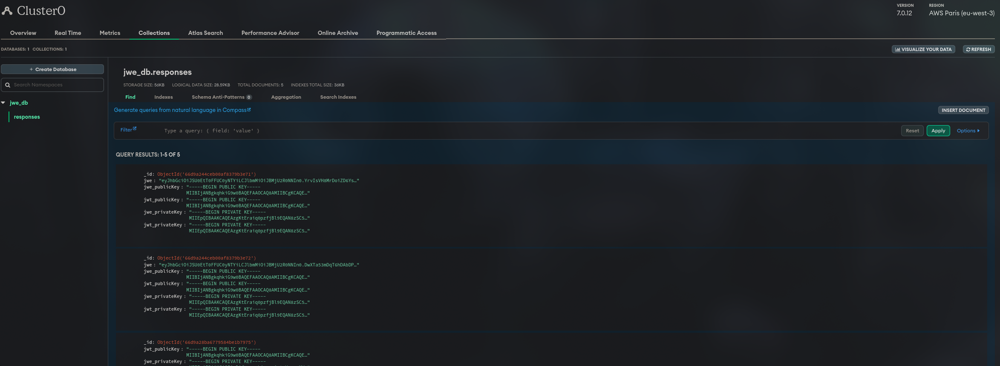

# JWE JWT Service
 

This project provides a service for generating and verifying JSON Web Encryption (JWE) and JSON Web Tokens (JWT) using RSA encryption. The service is built using Go, Gin, and MongoDB.

## Features

- Generate JWE from JWT with custom claims.
- Verify and decrypt JWE to retrieve the original JWT.
- Store responses in MongoDB.

## Prerequisites

- Go 1.23 or later
- MongoDB instance
- Environment variable `MONGO_URI` set to your MongoDB connection string.

## Installation

1. **Clone the repository:**

   ```sh
   git clone https://github.com/zvdy/go-JWE.git
   cd go-JWE
   ```

2. **Set up environment variables:**

   Ensure you have the `MONGO_URI` environment variable set to your MongoDB connection string.

   ```sh
   export MONGO_URI="your_mongodb_connection_string"
   ```

> I suggest using atlas, but you can deploy locally, if you decide to use Atlas, remember to whitelist 0.0.0.0 if you want your github action pipeline to run properly.

3. **Install dependencies:**

   ```sh
   go mod tidy
   ```

4. **Run the service:**

   ```sh
   go run main.go
   ```

   The server will start at `http://localhost:8080`


# Docker-Compose Deployment

The `docker-compose.yml` file is used to define and run multi-container Docker applications. In this project, it is used to set up the necessary services, including the database (if you want to run it locally).

## Steps to Deploy

1. **Install Docker and Docker-Compose**: Ensure Docker and Docker-Compose are installed on your machine.

2. **Configuration**: The `docker-compose.yml` file includes the configuration for the services required by the application. This typically includes the application service and a database service.

3. **Running the Services**: Use the following command to start the services defined in the `docker-compose.yml` file:
   ```sh
   docker-compose up


## API Endpoints

### Generate JWE

- **URL:** `/generate-jwe`
- **Method:** `POST`
- **Headers:**
  - `X-Claims`: Base64 encoded JSON string of claims.
- **Response:**
  - `200 OK`: Returns the generated JWE and keys.
  - `400 Bad Request`: If the `X-Claims` header is missing or invalid.
  - `500 Internal Server Error`: If there is an error during processing.

### Verify JWE

- **URL:** `/verify-jwe`
- **Method:** `POST`
- **Headers:**
  - `X-JWE`: The JWE string to be verified.
- **Response:**
  - `200 OK`: Returns the decrypted JWT.
  - `400 Bad Request`: If the `X-JWE` header is missing.
  - `500 Internal Server Error`: If there is an error during processing.

## Example Usage

### Generate JWE

```sh
curl -X POST http://localhost:8080/generate-jwe \
  -H "X-Claims: eyJzdWIiOiIxMjM0NTY3ODkwIiwibmFtZSI6IkpvaG4gRG9lIiwiaWF0IjoxNTE2MjM5MDIyfQ=="
```

### Verify JWE

```sh
curl -X POST http://localhost:8080/verify-jwe \
  -H "X-JWE: your_jwe_string_here"
```

### MongoDB Atlas view 



## Project Structure

- `main.go`: Main application file containing the service logic.
- `go.mod`: Go module file for dependency management.
- `claims/claims.go`: Script to automatically base64 encode claims.
- `.github/workflows/ci.yml`: GitHub Action workflow.
- `docker-compose.yml`: Adds the database logic.

## License

This project is licensed under the MIT License. See the LICENSE file for details.

## Contributing

Contributions are welcome! Please open an issue or submit a pull request for any improvements or bug fixes.

## Acknowledgements

- [Gin](https://github.com/gin-gonic/gin) - HTTP web framework for Go.
- [go-jose](https://github.com/square/go-jose) - An implementation of JOSE standards (JWE, JWS, JWT) in Go.
- [golang-jwt](https://github.com/golang-jwt/jwt) - A Go implementation of JSON Web Tokens.
